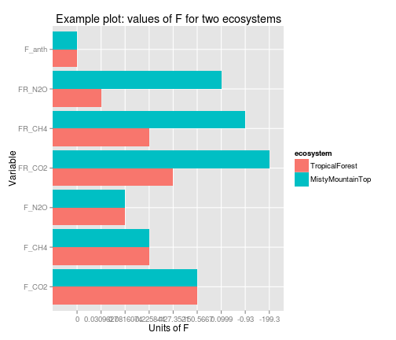

ghgvcR
======

R implementation of the Greenhouse Gas Value Calculator

Citation: Kristina J. Teixeira and Evan H. Delucia 2011. The greenhouse gas value of ecosystems. Global Change Biology. 17(1):425–438 doi: 10.1111/j.1365-2486.2010.02220.x

-------

### Inputs

* `inst/config.xml` example input file
* `inst/extdata/ghgvc1.Rdata` all objects used and provided by ghgvc 1.0
* `inputs.Rdata` example of inputs as R objects for ghgvcR example (below)

### Outputs 

produced by example below:

* `inst/extdata/output.csv`
* `inst/extdata/output.json`

### Installing the ghgvcR package on the PEcAn 1.2.6 VM

The bash and R code snippets below install dependencies, and only need to be run once. 

```
sudo apt-get install git
sudo apt-get install libcurl4-openssl-dev # dependency of Rcurl, 

git clone https://github.com/dlebauer/pecan.git pecan
git clone https://github.com/dlebauer/ghgvcR.git ghgvcR
R 
```


```r
install.packages(c("devtools", "roxygen2"), repos = "http://cran.us.r-project.org")
library(devtools)
install(ghgvcR)
install(pecan/utils)
```


### Example of how to run the calculator

* This can be run at the command line: `./src/ghgvc_script.R`


```r

options(warn = FALSE)
# test('ghgvcR') example(ghgvcR)


## the following is equivalent to
config.xml <- system.file("config.xml", package = "ghgvcR")


config.list <- xmlToList(xmlParse(config.xml))
options <- config.list$options

ecosystem_data <- config.list$ecosystem_data

x <- ghgvcR::ghgvc(options, ecosystem_data)


writeLines(x, "inst/extdata/output.json")
write.csv(as.data.frame(fromJSON(x)), "inst/extdata/output.csv")
```


### Plots:


```r
ggplot(data = forcings.long, aes(x = factor(variable), y = value, fill = ecosystem)) + 
    geom_bar(position = "dodge", stat = "identity") + ggtitle(label = "Example plot: values of F for two ecosystems") + 
    xlab("Variable") + ylab("Units of F") + coord_flip()
```

 

